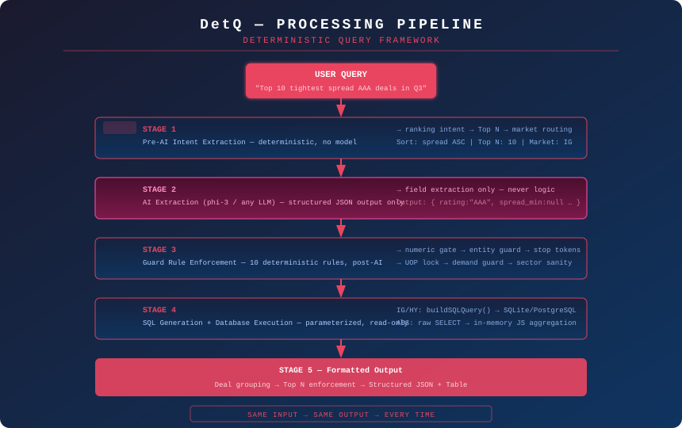

# DetQ — Deterministic Query Framework for Corporate Bond Analytics

> **Natural language. Zero hallucinations. Analyst-grade output.**


DetQ is a white-label, deterministic natural language query system (NLQS) designed for corporate bond analytics teams. It translates plain English questions into structured database queries — returning consistent, reproducible results with no AI inference, no invented assumptions, and no analyst intervention required.

---

## The Problem

At most credit funds and analyst firms, answering a simple question like:

> *"Show me the tightest spread investment-grade deals from Q3 rated AAA by Moody's"*

...requires an analyst to open Excel, filter multiple columns, cross-reference rating data, and format output manually. That takes **5 to 45 minutes per query**.

Multiply that across a team of analysts handling dozens of client requests per day, and you have a structural bottleneck — not a staffing problem.

---

## The Solution

DetQ sits as a query layer on top of your existing bond database. Analysts type natural language. DetQ deterministically extracts intent, applies guard rules, generates SQL, and returns structured output — every time, the same way.

```
"Top 10 tightest spread deals in October rated AAA"
        ↓
  Intent Extraction  →  AI Extraction (JSON only)  →  Guard Rules
        ↓
  SQL Generation  →  Database Execution  →  Formatted Table Output
```

**Key guarantee:** The AI model is used for structured field extraction only — never for reasoning, logic, or output generation. All financial logic is enforced deterministically in code, post-AI.

---

## What's In This Repo

| Folder | Contents |
|---|---|
| [`/framework`](./framework/) | Architecture spec, guard rule reference, schema mapping guide |
| [`/integration-plan`](./integration-plan/) | Consulting engagement overview and phased delivery plan |
| [`/financial-model`](./financial-model/) | Interactive ROI calculator (Excel) |
| [`/pitch-deck`](./pitch-deck/) | Executive pitch deck (PDF) |
| [`/assets`](./assets/) | Pipeline diagram and visual references |

---

## Core Design Principles

### 1. Determinism Over Intelligence
DetQ does not reason. It enforces. Every query goes through a fixed pipeline of guard rules that prevent the AI layer from inventing filters, issuers, thresholds, or field mappings that were not explicitly stated by the user.

### 2. Analyst Logic, Not Generic NLP
The guard rules encode how **bond analysts actually think** — not how a general-purpose language model interprets financial text. Keywords like `TLAC`, `GREEN`, and `M&A` are mapped to deal-flag fields, not ticker or issuer filters. `UOP` only activates the use-of-proceeds bucket when explicitly stated.

### 3. Schema Agnostic by Design
DetQ's field normalization layer maps incoming query criteria to your firm's specific database column names. The same natural language query works regardless of whether your database calls it `spread`, `deal_spread`, or `oas_spread`.

### 4. No Data Modification
DetQ is a read-only query layer. It cannot write, update, or delete records. Output is always a structured result set — never a mutation.

---

## Supported Markets

| Market | Default Grouping | Key Fields |
|---|---|---|
| Investment Grade (IG) | Deal-level (issuer + date + structure) | spread, size, rating, sector, book_size, deal flags |
| High Yield (HY) | Deal-level | spread, size, rating, sector, coupon, maturity |
| Asset-Backed Securities (ABS) | Deal-level by unique deal ID | WAL, tranche size, collateral, reinvestment period |

Cross-market querying is on the roadmap.

---

## Technology Stack

DetQ is built to integrate into standard financial technology environments:

| Layer | Technology |
|---|---|
| Frontend | Next.js |
| Backend | Node.js |
| Database | SQLite (swappable to PostgreSQL) |
| AI Extraction | Local LLM via Ollama (phi-3) or API-based equivalent |
| Runtime | Node.js + Express compatible |

No proprietary dependencies. No cloud lock-in during evaluation.

---

## Proof of Concept

DetQ's architecture was validated through a full production prototype deployed internally at a corporate bond analytics firm, covering:

- 2.3M+ data points across IG and ABS markets
- Analyst-validated query logic across 50+ query patterns
- Deterministic guard rule enforcement tested against known failure modes
- Executive-level demos to syndicate desks, buy-side analysts, and credit teams

---

## Repository Navigation

**If you're a technical evaluator:** Start with [`/framework/architecture-overview.md`](./framework/architecture-overview.md) for the full pipeline spec, then [`/framework/guard-rules-reference.md`](./framework/guard-rules-reference.md) for the deterministic logic layer.

**If you're evaluating a consulting engagement:** Start with [`/integration-plan/engagement-overview.md`](./integration-plan/engagement-overview.md) for scope and delivery structure.

**If you're building a business case:** Open [`/financial-model/roi-calculator.xlsx`](./financial-model/roi-calculator.xlsx) — enter your team size and query volume to see projected time savings and ROI.

**If you're preparing for an executive presentation:** See [`/pitch-deck/`](./pitch-deck/) for the full slide deck.

---

## Roadmap

- [x] IG deal-level query engine with deterministic guards
- [x] ABS market support with WAL aggregation and tranche awareness
- [ ] HY market full field coverage
- [ ] Cross-market unified query (IG + ABS in one result set)
- [ ] PostgreSQL adapter (production-scale databases)
- [ ] Authentication + permissions layer
- [ ] User behavior tracking + query pattern analytics
- [ ] Personalized analyst dashboards
- [ ] Read-only secure query API for client-facing deployment

---

## License

This repository contains a framework specification, integration planning documentation, and financial modeling templates. It does not include proprietary source code or client data.

---

*DetQ — Deterministic Query Framework | Corporate Bond Analytics*
